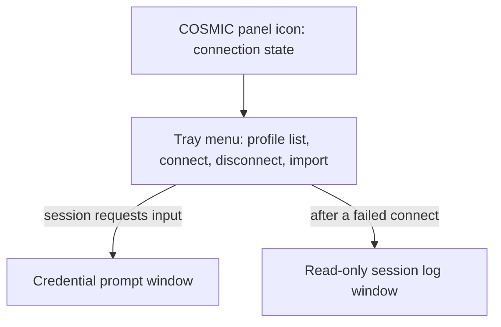
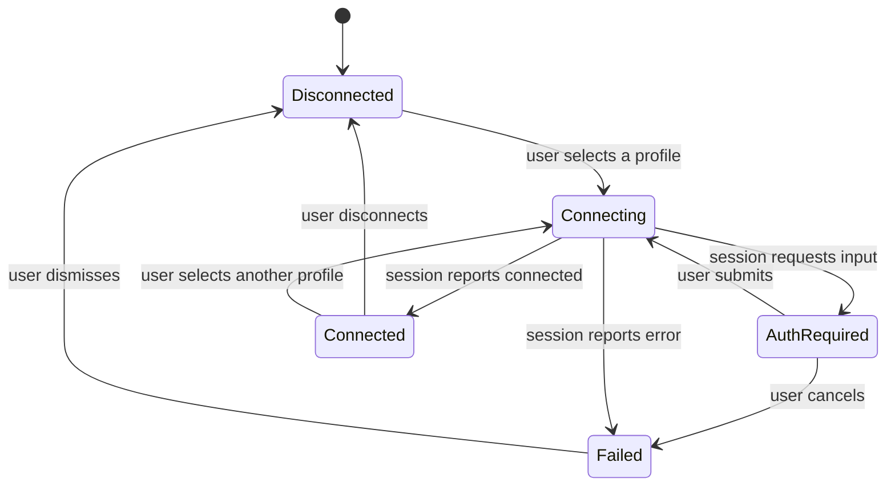
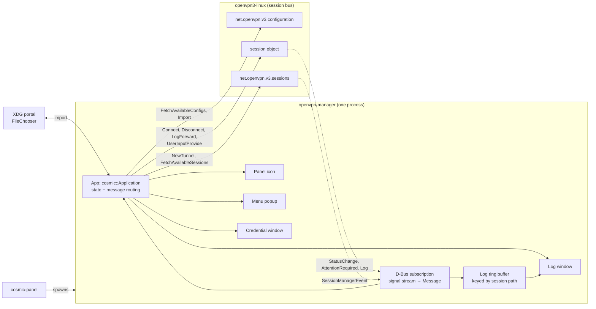

# OpenVPN3 Tray Manager - Plan

## Goal Capsule

- Objective: make VPN state legible at a glance and profile switching possible without a terminal, on Pop!_OS 24.04 under COSMIC.
- Product authority: this document. Requirements and scope boundaries here are settled; planning may not widen them.
- Open blockers: none.
- Repository: `github.com/alonespinoza/openvpn-manager` (public, currently empty — U1 bootstraps it).

**Product Contract preservation:** changed in three places, all confirmed with the user at the planning gate.
1. **Dependencies / Assumptions** — the assumption that the tray item registers against COSMIC's StatusNotifierItem watcher is superseded by KTD1, which makes this a native panel applet spawned by `cosmic-panel` directly. The Status Area dependency is removed, not weakened.
2. **Scope Boundaries** — a new entry under *Outside this product's identity* covers browser-based and smartcard authentication. openvpn3 can raise both, R8 does not cover either, and without an explicit boundary they would silently stall a connect. See KTD8.
3. **R16 added, and the *Autostart at login* deferral split.** The user asked for the applet to start with the machine. That deferral bundled two different things: the *applet* starting at login (now R16, in scope) and the *VPN* connecting or reconnecting on its own (still deferred). Only the first moves. See KTD9.

Existing requirement, actor, flow, and acceptance-example IDs are unchanged; R16 is additive.

---

## Product Contract

### Summary

A COSMIC panel applet that shows openvpn3 connection state at a glance and lets you connect, disconnect, and switch profiles from its menu. Importing a `.ovpn` happens from that same menu. Two windows exist and only on demand: the credential prompt openvpn3 requires mid-connect, and a read-only session log opened after a failure.

### Problem Frame

Every interaction with openvpn3 today goes through the terminal. The cost is not the typing itself — it is that connection state is invisible between commands. There is no ambient signal of whether a tunnel is up, so the question "am I on the VPN right now?" can only be answered by running a command and reading its output, and it gets asked far more often than any connect or disconnect happens.

Profile switching compounds it. Several profiles exist across different auth shapes — one cert-only, others requiring a password, a one-time code, or a private-key passphrase — and choosing between them means recalling profile names rather than picking from a list.

### Key Decisions

- **The tray is the application.** No persistent manager window. The recurring need is ambient state and fast switching, both of which a panel icon and its menu serve directly; a detail pane would be the largest thing to build and the least visited.

- **One active session at a time.** Selecting a profile disconnects whatever is running first. openvpn3 supports concurrent sessions, but the mental model here is "which VPN am I on", singular — and a single active session keeps the panel icon unambiguous.

- **Always prompt; never reconnect automatically.** Profiles requiring a one-time code cannot be resumed without the user present, so silent reconnect after sleep or a network change is impossible for them. Rather than behaving one way for cert-only profiles and another for the rest, every connect that needs input asks for it.

- **State is pushed, not polled.** The applet subscribes to openvpn3 session status signals instead of sampling on a timer. A status display that lags is worse than none, because it is trusted and wrong.

- **The log window is a failure escape hatch, not a live view.** It exists so a failed connect does not send you back to the terminal. It is not a monitoring surface, and it carries no throughput or endpoint detail.

The surfaces that result, and what opens each:



### Requirements

**Connection state visibility**

- R1. The panel icon communicates current state without opening anything, distinguishing at minimum connected, connecting, disconnected, and failed.
- R2. State changes reflect in the icon within about a second, driven by openvpn3 session status signals rather than periodic polling.
- R3. The tray menu names the active profile and how long the session has been up.

**Profile switching**

- R4. The tray menu lists every profile known to openvpn3, each showing its current state.
- R5. Selecting an inactive profile connects it; the active profile offers disconnect instead.
- R6. Connecting a profile while another session is active disconnects the active session first.

**Authentication**

- R7. When a session requests input mid-connect, the applet presents a prompt window and returns the response to that session.
- R8. The prompt handles username and password, one-time codes and challenge-response exchanges, and encrypted private-key passphrases.
- R9. No credential, code, or passphrase is persisted; every connect requiring input asks again.

**Profile import**

- R10. A `.ovpn` file can be imported from the tray menu without touching a terminal.
- R11. An imported profile appears in the tray list without restarting the applet.

**Failure diagnosis**

- R12. A failed connect is surfaced in the panel and the menu offers to open that session's log.
- R13. The log window is read-only and shows the most recent session attempt.

**Platform**

- R14. The applet runs as a tray item in the COSMIC panel on Pop!_OS 24.04 under Wayland.
- R15. Connect, disconnect, and import operate as the logged-in user, with no sudo prompt or root helper.
- R16. Once installed, the applet is present and reflecting live state from login onward, with no manual start step. It does not connect a VPN on its own.

### Key Flows

- F1. Glance
  - **Trigger:** User looks at the panel.
  - **Steps:** Icon already reflects the live session state; nothing is opened.
  - **Outcome:** The "am I connected?" question is answered without interaction.
  - **Covered by:** R1, R2

- F2. Switch to a cert-only profile
  - **Trigger:** User opens the tray menu and selects an inactive profile.
  - **Steps:** Active session, if any, disconnects; selected profile connects; no prompt appears.
  - **Outcome:** Icon settles on connected and the menu header names the new profile.
  - **Covered by:** R3, R4, R5, R6

- F3. Connect a profile requiring a one-time code
  - **Trigger:** User selects a profile whose session raises an input request during the handshake.
  - **Steps:** Prompt window opens with the challenge; user submits; session continues.
  - **Outcome:** Connected, with nothing retained for next time.
  - **Covered by:** R7, R8, R9

- F4. Connect fails
  - **Trigger:** A session reports an error instead of reaching connected.
  - **Steps:** Icon shows failed; menu offers the session log; user opens it read-only.
  - **Outcome:** Cause is visible without returning to the terminal.
  - **Covered by:** R12, R13

- F5. Import a profile
  - **Trigger:** User picks import from the tray menu and chooses a `.ovpn` file.
  - **Steps:** Profile is registered with openvpn3 and the menu list refreshes.
  - **Outcome:** The new profile is immediately selectable.
  - **Covered by:** R10, R11

The states the icon and menu render, and the transitions between them:



### Acceptance Examples

- AE1. Switching disconnects the previous session
  - **Covers R6.**
  - **Given** a session on one profile is connected,
  - **When** the user selects a different profile from the tray menu,
  - **Then** the first session is disconnected before the second connects, and the icon never shows two active sessions.

- AE2. A cancelled prompt does not leave a half-open session
  - **Covers R7, R12.**
  - **Given** a profile's connect has raised a one-time-code prompt,
  - **When** the user cancels instead of submitting,
  - **Then** the attempt ends, the icon shows failed rather than connecting, and no session remains running.

- AE3. Credentials are re-requested every time
  - **Covers R9.**
  - **Given** the user connected a password-protected profile earlier in the session,
  - **When** they disconnect and connect that same profile again,
  - **Then** the prompt appears again with nothing pre-filled.

- AE4. State survives a change made outside the applet
  - **Covers R2.**
  - **Given** the applet is running and shows connected,
  - **When** the session is disconnected from a terminal instead of the menu,
  - **Then** the icon updates to disconnected without the user touching the applet.

### Success Criteria

- Answering "am I connected, and to what?" requires no clicks and no typing.
- A full connect of the one-time-code profile, start to finish, involves no terminal.
- A failed connect can be diagnosed from the log window alone.

### Scope Boundaries

**Deferred for later**

- A manager window with per-profile detail, endpoint, throughput, or a live log tail.
- Deleting or renaming profiles from the UI — import is the only profile-management operation in scope.
- Auto-connecting a designated profile at login, and reconnect after sleep or a network change. *(The applet's own autostart was split out of this deferral and is now R16.)*
- Concurrent sessions across multiple profiles.
- Storing credentials in a keyring.
- A global-hotkey switcher overlay.

**Outside this product's identity**

- Desktops other than COSMIC on Wayland — no GNOME, KDE, or X11 fallback.
- VPN backends other than openvpn3, including WireGuard and openvpn2.
- Multi-user or shared-machine deployment.
- Editing profile contents in-app.
- Browser-based (`OPEN_URL`) and smartcard/PKCS#11 authentication. R8 names three auth shapes and these are neither; openvpn3 can still raise them, so the applet detects and reports them rather than pretending to handle them. See KTD8. *(Added during planning, confirmed with the user.)*

### Dependencies / Assumptions

- Depends on `openvpn3-linux` being installed with its session D-Bus services reachable by the logged-in user.
- ~~Depends on COSMIC's Status Area applet running, which provides the StatusNotifierItem watcher and the DBusMenu host the tray item registers against.~~ **Superseded by KTD1.** The applet is spawned directly by `cosmic-panel` from its own desktop entry; the Status Area and its SNI watcher are not in the dependency chain.
- ~~Assumes COSMIC's tray support is stable enough to carry the primary interface.~~ **Narrowed by KTD1 and KTD6.** The remaining substrate assumption is that a libcosmic applet can open a second, focusable window that accepts keyboard input under Wayland. U1 exists to prove exactly this before anything else is built.
- Assumes openvpn3 remains the source of truth for the profile list; the applet keeps no profile store of its own.
- Assumes openvpn3's session status signals report every state the icon needs to distinguish, including transitions caused outside the applet.
- Development and testing happen directly on the Pop!_OS 24.04 target machine, so the real COSMIC panel and real openvpn3 services are available at every step. No cross-machine sync loop or VM graphics stack is in the picture.

### Outstanding Questions

**Resolved during planning**

- ~~Implementation language and UI toolkit, and whether the tray item ships as a COSMIC applet proper or a standalone StatusNotifierItem process.~~ → KTD1 (Rust + libcosmic, native applet).
- ~~How connection states map to icon variants, and whether a distinct auth-pending icon is warranted.~~ → KTD3 (five states; auth-pending is distinct).
- ~~Whether the log window reads openvpn3's log service directly or a buffer the applet captures during the session.~~ → KTD4 (in-process buffer; the log service offers no historical retrieval to an unprivileged front-end).

**Deferred to implementation**

- Exact icon artwork and whether the five states need distinct glyphs or can share a glyph with distinct overlays. A decision for whoever draws them; the state set is fixed by KTD3.
- Whether the connect state machine needs an explicit timeout when a session neither connects nor reports an error. Add one only if the real services exhibit it — inventing a timeout without evidence risks aborting slow-but-healthy handshakes.
- Ring buffer capacity for captured log lines. Pick from what a real failed connect actually produces.

---

## Planning Contract

### Key Technical Decisions

#### KTD1. Rust + libcosmic, as a native COSMIC applet — not a standalone StatusNotifierItem process

The applet ships as its own binary with a desktop entry carrying `X-CosmicApplet=true`, discovered by `cosmic-settings` and spawned as a child process by `cosmic-panel`.

The brainstorm assumed the alternative: a standalone process registering as a StatusNotifierItem against COSMIC's Status Area, which acts as SNI watcher and DBusMenu host. Three things decide against it.

- **It adds the least stable dependency in the stack.** The status-area watcher moved to its own socket-activated daemon in February 2026. A native applet is spawned by the panel directly and does not touch that path at all.
- **The toolkit is needed regardless.** R7 and R13 require a credential prompt and a log window. DBusMenu cannot render either, so an SNI build pulls in a GUI toolkit anyway — which removes the "SNI is the lighter option" argument entirely.
- **DBusMenu is a poor fit for the menu the requirements describe.** R3 and R4 want a live per-profile state list with a running session duration. That is dynamic, frequently-updated content; DBusMenu's model is a static-ish item tree with property updates, and libcosmic's popup gives direct control over the same content.

The cost is that this forecloses non-COSMIC desktops. That cost is already accepted — "Desktops other than COSMIC on Wayland" is an identity boundary, not a deferral.

Concretely: `libcosmic` with the `applet` feature, which pulls in `multi-window`, `wayland`, `tokio`, `autosize`, and `cosmic-panel-config` together. Entry point is `cosmic::applet::run::<App>()` rather than `cosmic::app::run`.

#### KTD2. `zbus` for all D-Bus interaction, with typed proxies per openvpn3 service

`zbus` is async and tokio-native, which matches the runtime libcosmic's applet feature already enables — no second runtime, no bridging thread. Its `#[proxy]` attribute generates typed client traits from an interface definition, which keeps the three openvpn3 services (configuration, sessions, per-session objects) as compile-checked surfaces rather than stringly-typed calls.

Three proxies are needed:

| Service | Object | Used for |
|---|---|---|
| `net.openvpn.v3.configuration` | `/net/openvpn/v3/configuration` | `FetchAvailableConfigs`, `Import` |
| `net.openvpn.v3.configuration` | `/net/openvpn/v3/configuration/${ID}` | `name` property |
| `net.openvpn.v3.sessions` | `/net/openvpn/v3/sessions` | `NewTunnel`, `FetchAvailableSessions`, `SessionManagerEvent` |
| `net.openvpn.v3.sessions` | `/net/openvpn/v3/sessions/${ID}` | `Connect`, `Disconnect`, `Ready`, `LogForward`, `UserInputQueue*`, `StatusChange`, `AttentionRequired`, `Log` |

All calls run on the session bus as the logged-in user, satisfying R15 with no privileged helper.

#### KTD3. Five icon states, derived from `StatusChange` via an explicit mapping table

R1 names four states as a minimum. Planning adds a fifth: **auth-pending**. When a connect stalls waiting on a one-time code and the prompt window is behind something else, the panel is the only surface that can say so — and F3 makes that the flow most likely to be interrupted. Without it, auth-pending renders identically to connecting, and a stalled connect looks like a slow one.

openvpn3 reports state as a `(StatusMajor, StatusMinor, String)` tuple. The mapping:

| Icon state | `StatusMajor` | `StatusMinor` |
|---|---|---|
| **Disconnected** | `CONNECTION` (2) | `CONN_DISCONNECTED` (9), `CONN_DONE` (16) |
| | `SESSION` (3) | `SESS_REMOVED` (19) |
| | *(also: no session object exists)* | |
| **Connecting** | `CONFIG` (1) | `CFG_OK` (2) |
| | `CONNECTION` (2) | `CONN_INIT` (5), `CONN_CONNECTING` (6), `CONN_RECONNECTING` (12), `CONN_DISCONNECTING` (8) |
| **Connected** | `CONNECTION` (2) | `CONN_CONNECTED` (7) |
| **Auth-pending** | `CONFIG` (1) | `CFG_REQUIRE_USER` (4) |
| | `SESSION` (3) | `SESS_AUTH_USERPASS` (20), `SESS_AUTH_CHALLENGE` (21), `SESS_AUTH_URL` (22) |
| **Failed** | `CONFIG` (1) | `CFG_ERROR` (1), `CFG_INLINE_MISSING` (3) |
| | `CONNECTION` (2) | `CONN_FAILED` (10), `CONN_AUTH_FAILED` (11) |
| | `PROCESS` (5) | `PROC_KILLED` (29) |

Anything unmapped falls through to the current state rather than a default, and is recorded in the log buffer. Silently collapsing an unknown status to *disconnected* would produce exactly the "trusted and wrong" display the Product Contract rejects.

`SESS_AUTH_URL` maps to auth-pending for the icon, but the prompt cannot service it — KTD8 covers what happens next.

Paused states (`CONN_PAUSING` 13, `CONN_PAUSED` 14, `CONN_RESUMING` 15) are unreachable: the applet never calls `Pause`. If one arrives from an external actor, treat it as connecting and log it.

#### KTD4. The log window reads an in-process ring buffer captured live, not the log service

The log service (`net.openvpn.v3.log`) has no API for retrieving a completed session's history, and its `ProxyLogEvents` method is restricted to the `openvpn` user — unavailable to this applet under R15. The session object's `last_log` property holds a single entry, not a transcript.

So the only way to satisfy R13 is to capture events as they happen: call `LogForward(true)` on the session object **immediately after `NewTunnel` and before `Connect`**, subscribe to that session's `Log` signal, and append into a bounded ring buffer keyed by session path.

Two consequences to build for, not work around:

- **Ordering is load-bearing.** Enabling forwarding after `Connect` loses the early handshake lines, which are exactly the ones a failed connect needs. This constrains U3's sequencing.
- **Externally-started sessions have no buffer.** AE4 requires adopting sessions the applet did not start, and for those there is nothing captured. The log window shows an explicit "no log captured — this session started outside the applet" rather than an empty pane. An empty pane reads as a bug or as a clean run; neither is true.

#### KTD5. The single-session invariant is enforced by a serialized transition state machine

AE1 requires that the icon never shows two active sessions. `NewTunnel` returns as soon as the backend process starts, and `Connect` returns immediately without waiting for the tunnel — so issuing disconnect-then-connect without waiting produces a window where both sessions exist.

The applet holds one `PendingTransition` at a time. A profile selection while a session is active becomes: request disconnect → **await** the old session reaching `CONN_DISCONNECTED`/`SESS_REMOVED` or its object vanishing → then `NewTunnel` on the new config. Selections arriving mid-transition replace the queued target rather than starting a second chain.

#### KTD6. Credential prompt and log window are ordinary toplevel windows, not panel popups

libcosmic's applet popups are layer-shell surfaces anchored to the panel, and they dismiss on focus loss. A half-typed one-time code destroyed by an accidental click elsewhere is a bad enough outcome to rule the pattern out — particularly for F3, where the code is often being read off a phone. Both windows are separate surfaces via the `multi-window` support the applet feature enables.

The tray menu itself stays a popup: it is transient by nature and dismiss-on-focus-loss is correct there.

#### KTD7. Import goes through the XDG Desktop Portal file chooser

R10 needs a file picker. Using the portal (`ashpd`) rather than a toolkit-native dialog is the correct Wayland path and keeps the applet indifferent to sandboxing. The chosen file is read to a string and passed to `Import(name, config_str, single_use=false, persistent=true)` — `persistent` because R11's profile must survive a restart, and `single_use=false` because the profile is meant to be connected repeatedly.

The profile name defaults to the file stem. openvpn3 permits duplicate names, so the menu disambiguates by config object path rather than assuming names are unique.

#### KTD8. Unsupported attention requests fail loudly and immediately

`AttentionRequired(type, group, message)` can carry combinations R8 does not cover. The applet routes on the pair:

| `ClientAttentionType` | `ClientAttentionGroup` | Handling |
|---|---|---|
| `CREDENTIALS` (1) | `USER_PASSWORD` (1) | Prompt: username + password |
| `CREDENTIALS` (1) | `PK_PASSPHRASE` (3) | Prompt: passphrase, masked |
| `CREDENTIALS` (1) | `CHALLENGE_STATIC` (4), `CHALLENGE_DYNAMIC` (5) | Prompt: challenge text + response |
| `CREDENTIALS` (1) | `HTTP_PROXY_CREDS` (2), `CHALLENGE_AUTH_PENDING` (6), `OPEN_URL` (9) | Unsupported → disconnect, icon to failed, reason in log buffer |
| `PKCS11` (2) | `PKCS11_SIGN` (7), `PKCS11_DECRYPT` (8) | Unsupported → disconnect, icon to failed, reason in log buffer |
| `ACCESS_PERM` (3) | any | Unsupported → disconnect, icon to failed, reason in log buffer |

Ignoring an unsupported request leaves the session waiting forever behind a *connecting* icon with no way for the user to learn why. Failing with a named reason is worse UX than handling it and far better than hanging.

#### KTD9. Autostart comes from panel membership, made explicit at install rather than mechanised separately

R16 is largely a property of KTD1 rather than a feature: `cosmic-panel` spawns its configured applets at session start, so an applet added to the panel is running from login with no further machinery. Adding a systemd user unit or an XDG autostart entry on top of that would produce a *second* instance racing the panel-spawned one — two icons, two D-Bus subscriptions, and a single-session invariant (KTD5) enforced by two processes that cannot see each other's pending transitions.

So the decision is what **not** to build. R16 is satisfied by:

- `just install` registering the desktop entry so the applet is selectable in `cosmic-settings`, and the README naming the add-to-panel step as required rather than optional — this is the one manual action, done once, and R16's "no manual start step" refers to every login after it.
- A single-instance guard: on startup, the applet checks for an existing instance and exits rather than starting a second. This is cheap insurance against the two-instance failure above, which would otherwise be silent and confusing.
- Verification at U9 that survives a real reboot, not just a panel restart.

If a future need puts the applet outside the panel, an XDG autostart entry becomes the right mechanism — but adding it now, while panel-spawned, is the bug.

### High-Level Technical Design

*Directional — communicates structure and sequencing for review, not an implementation specification.*

**Component topology.** The applet is a single process holding one D-Bus connection, bridging openvpn3's signal stream into libcosmic's subscription system.



**Connect with a credential prompt (F3), showing where log forwarding must be enabled.** This is the sequence KTD4 and KTD5 constrain.

```mermaid
sequenceDiagram
  participant U as User
  participant A as Applet
  participant SM as Session manager
  participant S as Session object

  U->>A: select profile
  Note over A: KTD5 — if a session is active,<br/>disconnect and await removal first
  A->>SM: NewTunnel(config_path)
  SM-->>A: session_path
  A->>S: LogForward(true)
  Note over A,S: KTD4 — before Connect,<br/>or the handshake lines are lost
  A->>S: Connect()
  S-->>A: StatusChange(CONNECTION, CONN_CONNECTING)
  A->>A: icon → connecting
  S-->>A: AttentionRequired(CREDENTIALS, CHALLENGE_DYNAMIC, msg)
  A->>A: icon → auth-pending
  A->>S: UserInputQueueCheck / Fetch
  S-->>A: queued input request(s)
  A->>U: prompt window (KTD6)
  alt user submits
    U->>A: response
    A->>S: UserInputProvide(...)
    A->>S: Ready()
    S-->>A: StatusChange(CONNECTION, CONN_CONNECTED)
    A->>A: icon → connected; zeroize response
  else user cancels (AE2)
    U->>A: cancel
    A->>S: Disconnect()
    A->>A: icon → failed; no session remains
  end
```

### Output Structure

```text
openvpn-manager/
├── Cargo.toml
├── justfile                       # build, install, uninstall
├── README.md
├── data/
│   ├── io.github.alonespinoza.OpenvpnManager.desktop
│   ├── io.github.alonespinoza.OpenvpnManager.metainfo.xml
│   └── icons/                     # five state variants, scalable
├── src/
│   ├── main.rs                    # cosmic::applet::run entry
│   ├── app.rs                     # Application impl, Message enum, window routing
│   ├── state.rs                   # AppState, ConnectionState, PendingTransition
│   ├── ui/
│   │   ├── panel.rs               # icon selection + view
│   │   ├── menu.rs                # popup: profile list, actions
│   │   ├── auth_window.rs         # credential prompt
│   │   └── log_window.rs          # read-only log view
│   ├── openvpn/
│   │   ├── mod.rs
│   │   ├── config.rs              # configuration manager proxy
│   │   ├── session.rs             # session manager + session object proxies
│   │   ├── status.rs              # StatusMajor/Minor enums + icon mapping
│   │   ├── attention.rs           # ClientAttention enums + UserInputQueue
│   │   └── logbuf.rs              # bounded ring buffer
│   ├── subscription.rs            # D-Bus signal stream → iced subscription
│   └── portal.rs                  # ashpd FileChooser
└── tests/
    ├── fake_openvpn3/             # mock services on a private bus
    ├── status_mapping.rs
    ├── transitions.rs
    └── attention_routing.rs
```

The per-unit `**Files:**` lists remain authoritative; this tree is the expected shape, not a constraint.

---

## Implementation Units

Grouped into four phases. Phase A exists to disprove the riskiest assumption before the rest is built.

### Phase A — Prove the substrate

### U1. Repo bootstrap and applet substrate spike

**Goal:** Establish the repository and prove that a libcosmic applet can render in the COSMIC panel, open a popup, and open a second window that accepts keyboard text input — before any VPN logic exists.

**Requirements:** R14. De-risks the substrate assumption in Dependencies / Assumptions, and KTD1, KTD6.

**Dependencies:** none.

**Files:**
- `Cargo.toml` — `libcosmic` with `applet` feature, `tokio`
- `justfile` — `build`, `install`, `uninstall` recipes
- `README.md` — what it is, how to build and install on the target
- `data/io.github.alonespinoza.OpenvpnManager.desktop` — `X-CosmicApplet=true`, `NoDisplay=true`
- `data/io.github.alonespinoza.OpenvpnManager.metainfo.xml`
- `src/main.rs`, `src/app.rs`
- `.gitignore`

**Approach:** Initialize the local directory as a git repo and wire it to the existing empty `github.com/alonespinoza/openvpn-manager` remote. Scaffold from the libcosmic applet template. Entry point is `cosmic::applet::run::<App>()`. The spike renders a static icon, a popup with one button, and a button that opens a separate toplevel window containing a text field.

The second window is the whole point of this unit. Everything else here is scaffolding; if a focusable keyboard-accepting window under Wayland turns out to be difficult, KTD6 needs revisiting and that is far cheaper to learn now than after the D-Bus layer exists.

The repo scaffolding, desktop entry, and `justfile` are kept and grown by later units. The spike's *contents* — the placeholder button, the text field, the static icon — are throwaway, replaced by U4's real icon and U6's real prompt. Do not preserve them for their own sake once they have answered the question they exist to ask.

Install path is `~/.local/share/applications/` for the desktop entry — this is a single-user tool on the developer's own machine (R15, and multi-user deployment is out of identity).

**Patterns to follow:** No local precedent — this is the first code in the repo. Follow the libcosmic applet template's structure and the `cosmic-applets` in-tree applets for the `Application` impl shape.

**Test scenarios:** `Test expectation: none — scaffolding with no behavior to assert.` Verification for this unit is manual and on-target by design; there is no way to assert against a live COSMIC panel from a test process.

**Verification:**
- `just install` places the desktop entry, and the applet appears in `cosmic-settings` panel configuration.
- After adding it to the panel, the icon renders at the correct size across panel size presets.
- The popup opens on click and dismisses on focus loss.
- The second window opens, takes keyboard focus, and accepts typed text.
- The applet survives a `cosmic-panel` restart without manual intervention.

---

### Phase B — Talk to openvpn3

### U2. openvpn3 configuration and session manager proxies

**Goal:** Read the profile list and the currently-live sessions from openvpn3, and import a `.ovpn` blob.

**Requirements:** R4, R10, R15.

**Dependencies:** U1.

**Files:**
- `src/openvpn/mod.rs`
- `src/openvpn/config.rs`
- `src/openvpn/session.rs`
- `tests/fake_openvpn3/mod.rs` — mock services registered on a private bus
- `Cargo.toml` — add `zbus`

**Approach:** Typed `#[proxy]` traits per KTD2. Configuration side: `FetchAvailableConfigs() -> ao`, then the `name` property per config object; `Import(s, s, b, b) -> o`. Session side: `FetchAvailableSessions() -> ao`, `NewTunnel(o) -> o`, plus the per-session `config_path`, `session_name`, `status`, and `session_created` properties.

`session_created` is the Unix epoch of session start and is what R3's uptime is computed from — not a timer the applet starts, so uptime stays correct for sessions adopted from outside.

Profiles are keyed by config object path throughout, never by name (KTD7 — names are not unique).

The test double is a real D-Bus service implementing these interfaces on a private bus address. Mocking `zbus` itself would test the mock; standing up a fake service tests the wire contract, which is where the real risk is.

**Patterns to follow:** `zbus` `#[proxy]` derive; its `ObjectServer` for the test double.

**Test scenarios:**
- Fetching configs against a fake with three profiles returns three entries with the expected names and paths.
- Fetching configs against a fake with zero profiles returns an empty list, not an error — a fresh openvpn3 install is a legitimate state, and the menu must render for it.
- Two configs sharing the name `work` are returned as two distinct entries with distinct paths.
- Import with a valid config string returns a config path, and a subsequent fetch includes it.
- Import called with `persistent=true, single_use=false` is asserted at the fake's method boundary (R11 depends on both).
- Fetching sessions when one is live returns it with its `config_path` matching the originating profile.
- A D-Bus call against an absent `net.openvpn.v3.sessions` service surfaces a typed "openvpn3 unavailable" error rather than panicking — openvpn3 not being installed must not crash the panel applet.

**Verification:** Against the real openvpn3 on the target machine, the proxies list the same profiles as `openvpn3 configs-list` and the same sessions as `openvpn3 sessions-list`.

---

### U3. Session status stream, state model, and log capture

**Goal:** Turn openvpn3's signals into a live application state, and capture each session's log as it happens.

**Requirements:** R1, R2, R12, R13. Advances AE4.

**Dependencies:** U2.

**Files:**
- `src/openvpn/status.rs`
- `src/openvpn/logbuf.rs`
- `src/state.rs`
- `src/subscription.rs`
- `tests/status_mapping.rs`

**Execution note:** Write the status-mapping tests first. KTD3's table is a fixed, enumerable contract, and every entry has a known expected output — test-first here costs nothing and pins the mapping before UI work starts depending on it.

**Approach:** `StatusMajor`/`StatusMinor` as Rust enums with their numeric discriminants (KTD3), and a total mapping function to `ConnectionState`. Unmapped pairs return "no change" rather than a default, and are appended to the log buffer.

The subscription bridges three signal sources into the `Message` stream: per-session `StatusChange`, per-session `Log`, and the manager's `SessionManagerEvent`. `SessionManagerEvent` is what makes AE4 work for sessions the applet never started — it fires on session creation and destruction regardless of origin.

Log capture follows KTD4's ordering constraint: `LogForward(true)` on the session object before `Connect`. The ring buffer is bounded and keyed by session path; buffers for removed sessions are dropped except the most recent, which R13 needs after the session object is gone.

On startup, adopt existing sessions via `FetchAvailableSessions` and their `status` property, so a restarted applet shows the truth immediately rather than *disconnected* until the next signal.

**Patterns to follow:** libcosmic/iced subscription for external streams; `zbus` signal streams as the source.

**Test scenarios:**
- Every `(StatusMajor, StatusMinor)` pair in KTD3's table maps to its listed `ConnectionState`. One case per row.
- An unmapped pair (e.g. `PKCS11`/`PKCS11_SIGN`) leaves the current state unchanged and appends a line to the log buffer.
- `CONN_DISCONNECTING` maps to connecting, not disconnected — the tunnel is still up during teardown and an early *disconnected* icon would be wrong.
- A `StatusChange` arriving for a session path the applet is not tracking is ignored without panicking.
- Log buffer at capacity drops oldest lines and retains newest.
- A session removed via `SessionManagerEvent` drops its buffer, except when it is the most recent session, whose buffer survives for the log window.
- Startup adoption: with a fake reporting one live connected session, initial state is connected and names that profile, with no signal required.
- AE4 path: a fake session transitioning to `CONN_DISCONNECTED` without any applet-initiated call drives state to disconnected.

**Verification:** With the applet running against real openvpn3, starting and stopping a session from a terminal drives the internal state within about a second (R2), and the captured buffer for a deliberately-failed connect contains the failure cause.

---

### Phase C — The interface

### U4. Panel icon rendering

**Goal:** Render the five-state icon in the panel, driven by live state.

**Requirements:** R1, R2, R14.

**Dependencies:** U3.

**Files:**
- `src/ui/panel.rs`
- `data/icons/` — five scalable variants
- `src/app.rs` — wire subscription messages into view

**Approach:** Map `ConnectionState` to a named icon, sized from the applet `Context`'s `suggested_size()` so it tracks panel size presets. Icons follow the freedesktop naming convention with symbolic variants so COSMIC's light and dark themes both work.

**Patterns to follow:** `Context::icon_button` and the sizing helpers established in U1.

**Test scenarios:**
- Each of the five `ConnectionState` values selects a distinct icon name; no two states share one. This is the assertable half — that the *artwork* is legible is a manual check.
- A state change message updates the selected icon name without any other state mutation.

**Verification:** On-target, connect and disconnect a profile and watch the panel icon track it, in both light and dark themes and at the smallest and largest panel sizes.

---

### U5. Tray menu: profile list, connect, disconnect, switching

**Goal:** The menu that does the work — lists profiles with state, names the active session and its uptime, and drives connect/disconnect with the single-session invariant.

**Requirements:** R3, R4, R5, R6. Covers F2, and AE1.

**Dependencies:** U3, U4.

**Files:**
- `src/ui/menu.rs`
- `src/state.rs` — `PendingTransition`
- `src/app.rs`
- `tests/transitions.rs`

**Approach:** Popup listing every profile from U2, each row showing its state. The active profile's row offers disconnect; inactive rows offer connect. A header names the active profile and its uptime, computed from `session_created` (U2) and re-rendered on a display tick — a tick that only refreshes a label, not a state poll, so KTD's push-not-poll principle holds.

Switching implements KTD5's serialized transition: disconnect → await removal → `NewTunnel` → `LogForward(true)` → `Connect`. A selection arriving mid-transition replaces the queued target rather than starting a second chain.

**Test scenarios:**
- AE1: with a session active on profile A, selecting profile B issues `Disconnect` on A and does not call `NewTunnel` until A reports `CONN_DISCONNECTED`. Assert the call ordering at the fake.
- AE1 corollary: at no point during the switch do two session objects exist simultaneously from the applet's perspective.
- Selecting profile B, then profile C before B's transition completes, results in exactly one connect and it targets C.
- Selecting the active profile offers disconnect, not connect.
- Disconnect on the active session issues `Disconnect` and settles on disconnected.
- With no active session, the header shows no profile name and no uptime rather than a placeholder.
- Uptime renders from `session_created`, so a session adopted at startup shows its true age, not zero.
- A profile list of zero renders an empty-but-usable menu with import still available.
- A `Disconnect` that returns a D-Bus error leaves state at failed with the error captured, not stuck at connecting.

**Verification:** On-target, switch between the cert-only profile and a password profile repeatedly; `openvpn3 sessions-list` never shows two sessions, and the menu header tracks the active one.

---

### U6. Credential prompt window

**Goal:** Service openvpn3's mid-connect input requests, for the auth shapes R8 names — and fail clearly for the ones it does not.

**Requirements:** R7, R8, R9. Covers F3, and AE2, AE3.

**Dependencies:** U5.

**Files:**
- `src/ui/auth_window.rs`
- `src/openvpn/attention.rs`
- `tests/attention_routing.rs`

**Execution note:** Write the attention-routing tests first. KTD8's table is an enumerable contract with a security-relevant default (unsupported must fail, never hang), and pinning it before the window exists keeps the fallback from drifting to "ignore".

**Approach:** On `AttentionRequired(type, group, message)`, route per KTD8's table. For supported combinations, drain the input queue — `UserInputQueueCheck(type, group)` then `UserInputQueueFetch(type, group, id)` per item — and build the form from what the queue describes, masking fields the queue marks as hidden input. Submit each response with `UserInputProvide(type, group, id, value)`, then call `Ready()` to confirm the backend can proceed.

Nothing is persisted and nothing is pre-filled (R9). Response strings are zeroized after submission rather than left to drop naturally — this is a one-time code or a private-key passphrase, and the cost of zeroizing is nil.

Cancel implements AE2: `Disconnect()` on the session, state to failed, no session left running. Closing the window by its titlebar is a cancel, not a dismiss — leaving a session parked in auth-pending with no window to return to would strand it.

Unsupported combinations (KTD8) disconnect, set failed, and write a named reason into the log buffer so the log window can explain it.

**Test scenarios:**
- Every row of KTD8's table routes as listed. One case per row.
- `CREDENTIALS`/`USER_PASSWORD` producing two queue items yields a two-field form and two `UserInputProvide` calls with matching ids.
- A queue item marked hidden renders masked; one not marked renders plain.
- `CREDENTIALS`/`CHALLENGE_DYNAMIC` renders the challenge text from the signal message, so the user sees what they are answering.
- AE3: connecting a password profile twice in one applet run presents an empty form the second time — assert no value carries across.
- AE2: cancel issues `Disconnect`, drives state to failed rather than connecting, and leaves no session at the fake.
- Closing the window via titlebar takes the same path as cancel.
- `PKCS11`/`PKCS11_SIGN` disconnects and records a reason, rather than opening an empty prompt or hanging.
- `CREDENTIALS`/`OPEN_URL` disconnects and records a reason naming browser auth as unsupported.
- An `AttentionRequired` arriving after the user already cancelled is ignored without reopening the window.

**Verification:** On-target, complete a full connect of the one-time-code profile with no terminal involved (a Success Criterion), and confirm cancelling mid-prompt leaves `openvpn3 sessions-list` empty.

---

### U7. Profile import

**Goal:** Import a `.ovpn` from the menu and have it appear in the list immediately.

**Requirements:** R10, R11. Covers F5.

**Dependencies:** U5.

**Files:**
- `src/portal.rs`
- `src/ui/menu.rs` — import entry
- `Cargo.toml` — add `ashpd`

**Approach:** Menu item opens the XDG portal file chooser filtered to `.ovpn` (KTD7). The chosen file is read to a string and passed to `Import(stem, blob, false, true)`. On success, refresh the profile list from the configuration manager rather than optimistically appending — the manager is the source of truth per the Product Contract, and a refresh also picks up the real assigned name.

**Test scenarios:**
- A valid `.ovpn` string passed to import produces a config path and a subsequent refresh includes it (R11).
- Import is called with `single_use=false, persistent=true`.
- The profile name is the file stem, not the full path or filename with extension.
- A file openvpn3 rejects as invalid surfaces the error in the menu and leaves the existing list intact.
- An unreadable file (permissions) surfaces an error rather than importing an empty config.
- Cancelling the portal picker is a no-op — no import call, no error shown.

**Verification:** On-target, import a real `.ovpn` from the menu and connect it in the same applet run without a restart.

---

### U8. Failure surfacing and the log window

**Goal:** Make a failed connect diagnosable without returning to the terminal.

**Requirements:** R12, R13. Covers F4.

**Dependencies:** U3, U5.

**Files:**
- `src/ui/log_window.rs`
- `src/ui/menu.rs` — failure banner and log entry point
- `src/app.rs`

**Approach:** On failed state, the menu shows the failure with its status message and an entry to open the log. The window is read-only and renders the ring buffer for the most recent session (KTD4), scrollable, with selectable text so a line can be copied into a bug report.

Per KTD4, a session with no captured buffer — one adopted from outside the applet — shows an explicit "no log captured; this session started outside the applet" rather than an empty pane.

Failed state clears to disconnected on user dismissal, matching the Product Contract's state diagram.

**Test scenarios:**
- A session reaching `CONN_AUTH_FAILED` sets failed and the menu exposes the log entry point.
- The log window renders the buffered lines for the most recent session in arrival order.
- A session with an empty buffer renders the explicit no-log message, not a blank pane.
- The most recent session's buffer survives that session's removal, so the log is readable after the session object is gone.
- Dismissing the failure returns state to disconnected.
- A new connect attempt after a failure starts a fresh buffer rather than appending to the previous one.

**Verification:** On-target, deliberately fail a connect (wrong password) and diagnose the cause from the log window alone (a Success Criterion).

---

### Phase D — Ship it

### U9. Packaging, install, autostart, and documentation

**Goal:** A repeatable install on the target machine, an applet that is up and reporting state from every login onward, and a README that explains both.

**Requirements:** R14, R15, R16.

**Dependencies:** U1–U8.

**Files:**
- `justfile`
- `data/io.github.alonespinoza.OpenvpnManager.desktop`
- `data/io.github.alonespinoza.OpenvpnManager.metainfo.xml`
- `src/main.rs` — single-instance guard
- `README.md`

**Approach:** Finalize `just install` / `just uninstall` for the binary, desktop entry, icons, and metainfo, all under the user's home (R15 — no root step anywhere in the install).

Per KTD9, autostart is deliberately *not* a separate mechanism. Two things make R16 real:

- The single-instance guard in `main.rs`, before any UI or D-Bus setup. A well-known D-Bus name is the natural lock here — the applet already holds a session-bus connection, and name ownership gives the check for free without a stale-pidfile failure mode. Losing the race means exiting quietly, not erroring; a second instance is a user mistake, not a fault.
- README framing the add-to-panel step as required and one-time, so the distinction between "install once, add to panel once" and "starts itself every login after that" is not left for the user to infer.

README also covers the openvpn3 prerequisite, build, install, and the auth shapes supported versus not (KTD8), so that boundary is discoverable before someone hits it mid-connect.

**Test scenarios:**
- Starting a second instance while one holds the D-Bus name exits with success and without rendering a second icon or opening a second subscription.
- The first instance is unaffected by the second's attempt — its name ownership, state, and any active session survive.
- Releasing the name (first instance exits) lets a subsequent start acquire it and run normally, so a restart after a crash is not blocked by a stale lock.

**Verification:**
- `just uninstall && just install` from a clean state produces a working panel applet with no root prompt.
- Icons resolve in both light and dark themes after install.
- **R16, against a real reboot:** with the applet added to the panel, reboot the machine and log in — the icon is present and shows correct state without any manual step, and no VPN has connected on its own.
- A `cosmic-panel` restart alone also brings it back, and does so without producing a duplicate icon.
- A reader following the README alone, on a fresh Pop!_OS 24.04 COSMIC machine with openvpn3 installed, reaches a working applet that survives the next login.

---

## Verification Contract

**Automated.** `cargo test` covers the mapping tables, transition sequencing, and attention routing — the logic where a silent error would produce a confidently wrong display. D-Bus interaction is tested against a fake openvpn3 service on a private bus (U2), not against mocked `zbus` types.

**Manual, on-target.** Panel rendering, theming, popup and window behavior, and Wayland focus have no assertable surface from a test process. Each unit's Verification section names its on-target check; these are the plan's real gate, not a supplement to the automated tests.

**End-to-end, against the Success Criteria.** Before calling the work done, on the real machine:

1. Answer "am I connected, and to what?" with no clicks and no typing.
2. Complete a full connect of the one-time-code profile with no terminal at any point.
3. Diagnose a deliberately failed connect from the log window alone.
4. Disconnect from a terminal while the applet shows connected; the icon updates without interaction (AE4).
5. Switch directly between two profiles; `openvpn3 sessions-list` never shows two sessions (AE1).
6. Reboot and log in; the applet is up and showing correct state with no manual step, one icon only, and no VPN connected on its own (R16).

## Definition of Done

- R1–R16 are each satisfied by a landed unit, or explicitly deferred here (none are).
- AE1–AE4 each have passing coverage — AE1 in U5, AE2 and AE3 in U6, AE4 in U3 — plus the on-target end-to-end checks above.
- All six Verification Contract end-to-end checks pass on the Pop!_OS 24.04 target.
- `cargo test` and `cargo clippy` are clean.
- `just uninstall && just install` yields a working applet with no root prompt (R15).
- The README's install path has been followed start to finish at least once.
- No credential, code, or passphrase is written to disk, to the log buffer, or to any log line (R9). Verified by inspecting the captured buffer after a password connect.

---

## Risks & Dependencies

| Risk | Impact | Mitigation |
|---|---|---|
| A libcosmic applet cannot open a focusable keyboard-accepting window under Wayland | KTD6 collapses; the credential prompt has no home and R7 is unbuildable as designed | U1 exists solely to prove this before anything depends on it. Fallback is a layer-shell popup with explicit keyboard interactivity, accepting the dismiss-on-focus-loss cost |
| `LogForward` fails or is restricted for the session owner | R13 unsatisfiable from the captured buffer; the log window has nothing to show | Prove in U3 against real openvpn3, early. Fallback is the session's `last_log` property plus the status message — much thinner, but non-empty |
| openvpn3's status signals do not report a transition the icon needs | The icon silently lags or shows a stale state, the exact failure the Product Contract calls "trusted and wrong" | KTD3's unmapped-pair rule surfaces gaps into the log buffer rather than swallowing them, so an unreported transition shows up during U3's on-target verification |
| libcosmic API churn between versions | Build breaks on a dependency bump | Pin exact versions in `Cargo.toml` and commit `Cargo.lock`. This is a single-machine tool; there is no reason to float |
| The panel spawns the applet before openvpn3's services are up at login | Applet starts in a permanently broken state — and R16 makes this the *normal* startup path, not an edge case | U2's typed unavailability error plus a retry on `SessionManagerEvent` availability, rather than failing once at startup. U9's reboot verification is what exercises it |
| Two instances run at once — panel-spawned plus a manual start | Two icons, two subscriptions, and KTD5's single-session invariant enforced by two processes blind to each other | KTD9's D-Bus name guard, with U9 covering both the losing and the stale-lock paths |

**External dependencies:** `openvpn3-linux` with session services reachable by the logged-in user; COSMIC 1.x on Pop!_OS 24.04 under Wayland; an XDG desktop portal implementation for U7.

---

## System-Wide Impact

Self-contained. The applet reads and writes only openvpn3's own state through its public D-Bus API, keeps no store of its own, and installs entirely under the user's home directory. Nothing outside the repo changes.

The one shared surface is openvpn3's session state itself: while the applet runs, sessions it did not start are visible to it and can be disconnected through it. That is intended — AE4 depends on it — but it means the applet and a terminal are two front-ends onto one piece of state, and the single-session invariant (KTD5) is the applet's own model, not something openvpn3 enforces. A session started from a terminal while the applet holds one active can produce two live sessions; the applet reports this honestly rather than racing to correct it.

---

## Sources / Research

- [OpenVPN 3 Linux D-Bus overview](https://github.com/OpenVPN/openvpn3-linux/blob/master/docs/dbus/dbus-overview.md) — service layout for the session, client, and log interfaces.
- [`net.openvpn.v3.sessions` service docs](https://github.com/OpenVPN/openvpn3-linux/blob/master/docs/dbus/dbus-service-net.openvpn.v3.sessions.md) — `NewTunnel`, `Connect`, `Disconnect`, `Ready`, `LogForward`, the `UserInputQueue*` methods, and the `StatusChange` / `AttentionRequired` / `Log` signals. The basis for KTD2, KTD5, and U6's queue-draining flow.
- [`net.openvpn.v3.configuration` service docs](https://github.com/OpenVPN/openvpn3-linux/blob/master/docs/dbus/dbus-service-net.openvpn.v3.configuration.md) — `Import(name, config_str, single_use, persistent)` and `FetchAvailableConfigs`. The basis for KTD7.
- [`net.openvpn.v3.log` service docs](https://github.com/OpenVPN/openvpn3-linux/blob/master/docs/dbus/dbus-service-net.openvpn.v3.log.md) — **load-bearing negative result:** no API retrieves a completed session's log, and `ProxyLogEvents` is restricted to the `openvpn` user. This is what forces KTD4's in-process buffer and its ordering constraint.
- [openvpn3-linux `constants.hpp`](https://github.com/OpenVPN/openvpn3-linux/blob/master/src/dbus/constants.hpp) — the full `StatusMajor`, `StatusMinor`, `ClientAttentionType`, and `ClientAttentionGroup` enums with numeric values. KTD3's and KTD8's tables are derived directly from it.
- [libcosmic applet development](https://deepwiki.com/pop-os/libcosmic/4-applet-development) — `applet::run`, `Context` sizing from `COSMIC_PANEL_*` environment variables, popup settings, and confirmation that the `applet` feature enables `multi-window`. The basis for KTD1 and KTD6.
- [COSMIC applet desktop integration](https://deepwiki.com/pop-os/cosmic-applets/6.1-desktop-integration) — `X-CosmicApplet=true` and the panel's desktop-entry discovery, including third-party install into `~/.local/share/applications/`.
- [COSMIC applets status area](https://deepwiki.com/pop-os/cosmic-applets/3.4-status-area-and-minimize) — COSMIC's StatusNotifierItem watcher and DBusMenu host. Documents the path KTD1 rejects.
- [COSMIC Desktop 1.0.6 release notes](https://linuxiac.com/cosmic-desktop-1-0-6-released/) — the status-area watcher moved to its own socket-activated daemon in February 2026, the churn signal weighing against the SNI approach in KTD1.
- [`ksni`](https://lib.rs/crates/ksni) — the Rust StatusNotifierItem implementation the rejected alternative would have used. Recorded so the alternative is reconstructable if KTD1 is ever revisited.
